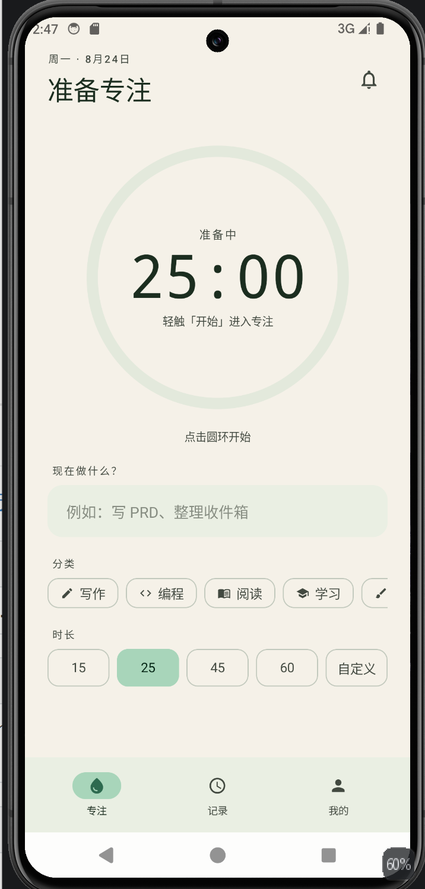
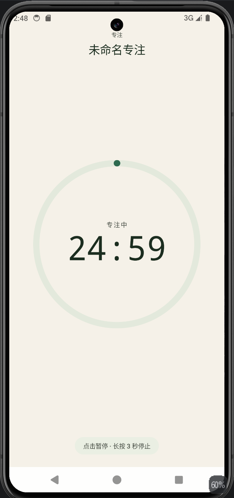
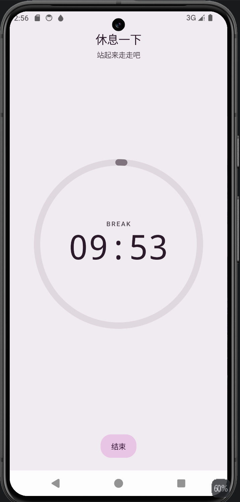
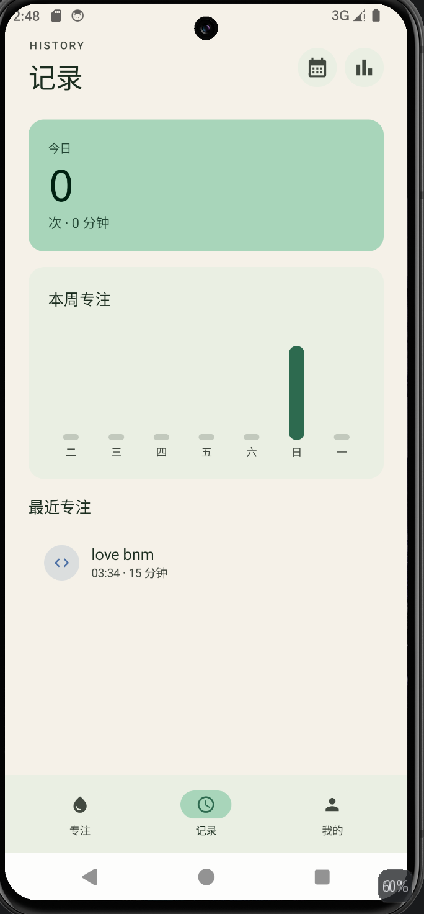
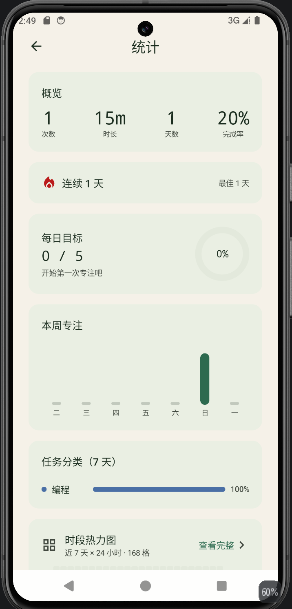
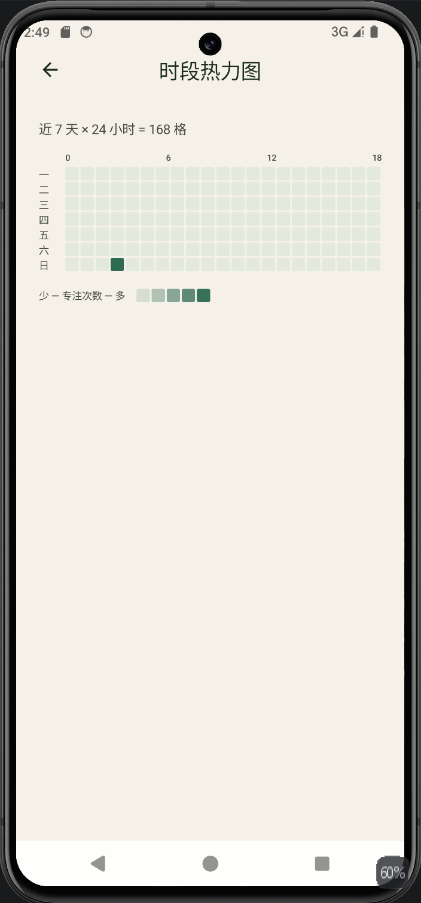
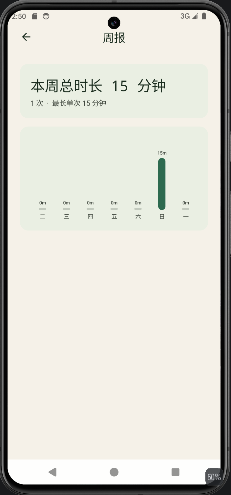
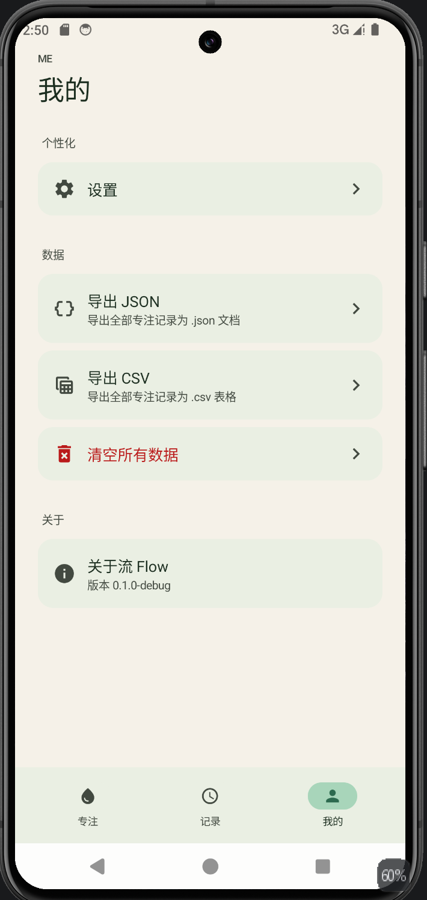
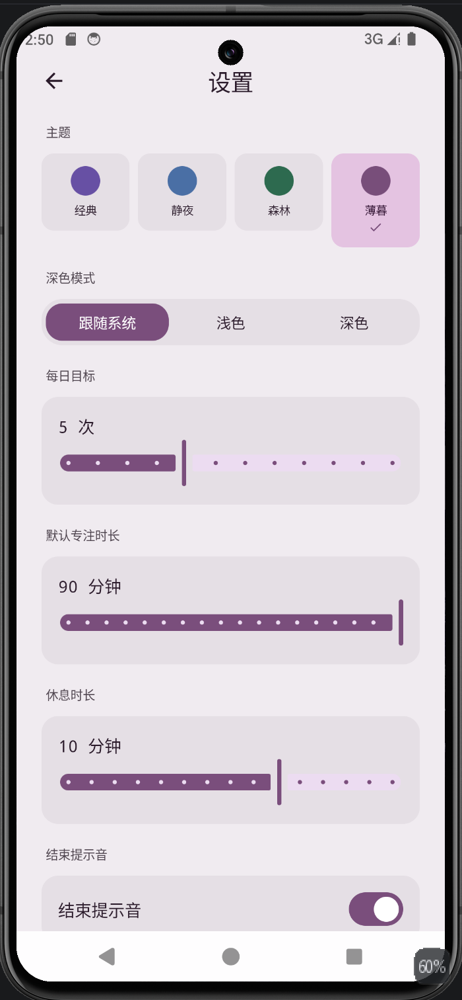

# 流 Flow

> 极简的深度工作计时器 —— 在一个被切碎的时代，依然拥有 25 分钟不被干扰的心流。


---

## 一、软件介绍

**流 Flow** 是一款反"功能堆砌"的极简深度工作计时器。市面上的番茄钟 App 越来越重 —— 任务管理、习惯打卡、好友 PK、商城……「流」反其道而行：**只做一件事 —— 计时**。砍掉所有噪音，只留一个圆环、一段时间、一个状态。

### 核心设计原则

| 原则       | 落地方式                                                                 |
| ---------- | ------------------------------------------------------------------------ |
| 极致克制   | 只有 1 个主屏 + 3 个二级屏，绝不堆功能                                  |
| 视觉沉浸   | 液态圆环动画 + 圆环短按 / 长按 3 秒扫光手势；零启动成本                  |
| 数据本地化 | 所有数据存在本机 Room + DataStore，**不**上传任何服务器，**不**需注册账号 |
| 沉浸专注   | ForegroundService 后台保活 + 通知中心常驻；屏蔽系统返回防误触            |
| MD3 视觉   | Material You 风格，4 套主题（经典 / 静夜 / 森林 / 薄暮），跟随系统浅深     |

### 目标用户

- 独立创作者（写作 / 设计 / 编程时需要仪式感）
- 研究生 / 学生（图书馆、自习室长时间专注）
- 远程工作者（缺乏节奏感，需要番茄钟打拍子）
- 冥想 / 读书爱好者（睡前阅读、晨间冥想）

### 核心能力一览

- ✅ 25 分钟（可自定义 5-90）专注 + 5 分钟（可设）休息
- ✅ 6 个任务分类（写作 / 编程 / 阅读 / 学习 / 设计 / 其他）+ 颜色编码
- ✅ 4 套主题（经典 / 静夜 / 森林 / 薄暮）× 浅深 = 8 套配色
- ✅ 完整统计面板：连续天数、4 KPI、分类条形图、工作日 vs 周末、最佳记录
- ✅ 7×24 = 168 格时段热力图
- ✅ 每日目标进度环
- ✅ 后台保活（ForegroundService + 通知中心常驻计时进度）
- ✅ 数据导出（JSON / CSV，UTF-8 BOM，Excel 友好）
- ✅ 圆环手势交互：短按暂停 / 继续，长按 3 秒红色扫光放弃

---

## 二、截图

> 截图存放于 `docs/screenshots/`。第一次跑起来后用模拟器/真机自己截即可（详见 [§三、工程运行](#三工程运行)）。

| 主屏（准备专注）        | 专注中（圆环动起来）         | 休息中                  |
| ----------------------- | ---------------------------- | ----------------------- |
|  |  |  |

| 记录（今日 + 7 天柱状） | 统计（4 KPI + Streak + 分类）  | 7×24 时段热力图          |
| ----------------------- | ------------------------------ | ------------------------- |
|  |  |  |

| 周报（7 天分钟）         | 我的（含数据导出）             | 设置（主题 + 浅深）       |
| ----------------------- | ------------------------------ | ------------------------- |
|  |  |  |

> 文件名按上面表格列出的命名，覆盖同名文件即可，README 会自动引用。

---

## 三、工程运行

### 3.1 前置依赖

- **JDK 17**（必须 17，不要 11 / 21）
- **Android Studio Koala (2024.1.1) 或更新**（推荐用 Quail 3 或更新）
- **Android SDK Platform 34 + Build-Tools 34.0.0**
- 可选：Pixel 8 / 三星 / 一加 等真机；或 Pixel 8 API 34 AOSP 模拟器

### 3.2 拉代码 + 打开

```powershell
# Android Studio → File → Open → 选 Q:\large_program\liu-flow\android
# AS 会自动：生成 gradle wrapper、同步依赖、生成 .idea/ 配置
```

### 3.3 跑起来

| 方式 | 步骤 |
|------|------|
| **真机** | USB 连手机 → 开发者选项开 USB 调试 → AS 顶栏选设备 → ▶ Run |
| **模拟器** | Tools → Device Manager → Create Device → Pixel 8 → API 34 image → 启动 → ▶ Run |

第一次跑会触发：Kotlin 编译（~30s）→ 打包 APK（~10s）→ 推送到设备（~5s）→ 启动 App。

### 3.4 截屏（用于 README 或文档）

```powershell
# 模拟器自带截图按钮（右侧 Extended Controls 面板 → 相机图标）
# 或 adb 命令行：
adb shell screencap -p /sdcard/01.png
adb pull /sdcard/01.png docs\screenshots\focus.png
```

启动 App 后，依次进入每个屏，截图保存到 `docs/screenshots/` 对应文件名（见 §二表格列出的命名）。

### 3.5 验证后台保活

1. 启动一次专注（点圆环）
2. 按 Home 键回桌面（**不要上滑杀掉 App**）
3. 下拉通知栏，应看到「专注中 · 剩余 24:13」常驻通知
4. 30 秒后回 App，时间应该准确继续

### 3.6 验证 DataStore 备份

```powershell
# 1. 在 App 里改主题 / 默认时长
# 2. 触发备份（需要真机 + Google 账户开启 Auto Backup）
adb shell bmgr backupnow com.liuflow.app.debug

# 3. 模拟重装
adb uninstall com.liuflow.app.debug
adb install app\build\outputs\apk\debug\app-debug.apk

# 4. 启动 App，确认设置恢复
```

> 完整步骤见 `android/SETUP.md` §6。

### 3.7 跑测试

```powershell
cd android
.\gradlew :app:testDebugUnitTest
```

`StatsCalculatorTest` 覆盖：overview 聚合 / streak / 7×24 heatmap / last7Days 缺日补零。

### 3.8 打包 Debug APK

```powershell
.\gradlew assembleDebug
# 产物：app\build\outputs\apk\debug\app-debug.apk
adb install -r app\build\outputs\apk\debug\app-debug.apk
```

---

## 四、项目文件架构

### 4.1 顶层目录

```
liu-flow/
├── README.md                # 本文件 — 项目总览
├── docs/                    # 文档与交付
│   ├── prd.md               # 产品需求文档
│   ├── 迭代记录-2026-08-23.md   # 本次迭代里程碑交付
│   ├── 项目交付执行情况.md  # 项目整体交付执行
│   ├── 软件迭代开发里程碑交付模板.md
│   └── screenshots/         # 截图（手动添加）
├── icon/                    # 原始品牌素材
├── prototype/               # HTML/CSS/JS 设计原型（9 个页面）
│   ├── index.html
│   └── pages/
│       ├── focus.html
│       ├── running.html
│       ├── rest.html
│       ├── history.html
│       ├── stats.html
│       ├── heatmap.html
│       ├── weekly.html
│       ├── me.html
│       └── settings.html
└── android/                 # Kotlin + Compose Android 工程
    ├── README.md
    ├── SETUP.md             # 详细部署文档
    ├── build.gradle.kts
    ├── settings.gradle.kts
    ├── gradle.properties
    ├── gradle/
    │   ├── libs.versions.toml
    │   └── wrapper/gradle-wrapper.properties
    └── app/
        ├── build.gradle.kts
        ├── proguard-rules.pro
        └── src/
            ├── main/
            │   ├── AndroidManifest.xml
            │   ├── java/com/liuflow/app/
            │   └── res/
            └── test/
                └── java/com/liuflow/app/data/stats/
```

### 4.2 Android 源码结构

```
app/src/main/java/com/liuflow/app/
├── FlowApp.kt               # Application：创建 AppContainer
├── MainActivity.kt           # ComponentActivity + edge-to-edge + 通知权限申请
├── AppContainer.kt           # 手动 DI（DB / Repository / Settings / Timer / ServiceController）
├── data/
│   ├── db/                   # Room：AppDatabase / SessionEntity / SessionDao / DailyGoalEntity / DailyGoalDao
│   ├── prefs/                # DataStore：SettingsRepository + UserSettings
│   ├── model/                # Category 枚举（6 分类）/ FlowTheme 枚举 / DarkMode
│   ├── repository/           # FlowRepository（业务层）
│   ├── stats/                # StatsCalculator（纯函数，统计核心）
│   └── export/               # DataExporter（CSV / JSON）
├── timer/
│   ├── TimerController.kt    # 倒计时状态机：IDLE→RUNNING→PAUSED→COMPLETED→ABANDONED→RESTING
│   ├── FocusTimerService.kt  # ForegroundService：通知 + 后台保活
│   └── TimerServiceController.kt  # 监听状态机，自动启停 service
├── ui/
│   ├── theme/                # 4 套主题 × 浅深 + MD3 形状 + 字体
│   ├── components/           # FocusRing / BottomNavBar / PhoneFrame
│   ├── nav/                  # Routes + FlowNavHost
│   ├── focus/                # 主屏（含 CustomDurationDialog）
│   ├── running/              # 全屏专注（圆环短按 / 长按 3s 扫光）
│   ├── rest/                 # 休息
│   ├── history/              # 记录
│   ├── stats/                # 完整统计（含 MiniHeatmapCard）
│   ├── heatmap/              # 7×24 时段热力图
│   ├── weekly/               # 周报
│   ├── me/                   # 我的（含 JSON / CSV 导出）
│   ├── settings/             # 设置（主题 / 浅深 / 默认时长 / 每日目标）
│   └── FlowViewModelFactory.kt   # 单一 ViewModel 工厂
└── util/
    ├── DateUtils.kt          # 日期工具（weekday Mon=0, YYYY-MM-DD）
    ├── TimeFormat.kt         # mmss / friendlyMinutes
    ├── ChimePlayer.kt        # AudioTrack 合成 C5→E5 钟声
    └── VibrateUtil.kt        # 震动工具
```

### 4.3 9 个屏的对应

| 路由              | 源码位置                                  | 描述                                     |
| ----------------- | ----------------------------------------- | ---------------------------------------- |
| `focus`           | `ui/focus/FocusScreen.kt`                 | 主屏：任务输入 + 6 分类 + 时长 + 圆环启动 |
| `running`         | `ui/running/RunningScreen.kt`             | 全屏专注：圆环短按 / 长按 3s 扫光手势   |
| `rest`            | `ui/rest/RestScreen.kt`                   | 休息：自动 5min                          |
| `history`         | `ui/history/HistoryScreen.kt`             | 记录：今日 + 7 天柱状 + 最近列表         |
| `stats`           | `ui/stats/StatsScreen.kt`                 | 完整统计：4 KPI + Streak + 分类 + 目标环 |
| `heatmap`         | `ui/heatmap/HeatmapScreen.kt`             | 7×24 = 168 格时段热力图                  |
| `weekly`          | `ui/weekly/WeeklyScreen.kt`               | 7 天分钟柱状图                           |
| `me`              | `ui/me/MeScreen.kt`                       | 我的：导出 / 清空 / 关于                  |
| `settings`        | `ui/settings/SettingsScreen.kt`           | 设置：主题 / 浅深 / 时长 / 目标          |

---

## 五、技术栈

| 维度       | 选型                                  | 理由                                |
| ---------- | ------------------------------------- | ----------------------------------- |
| 语言       | Kotlin 2.0.20                         | 官方推荐，Compose 配套               |
| UI         | Jetpack Compose (BOM 2024.09)         | 声明式，状态驱动                    |
| 视觉       | Material 3（4 主题 × 浅深）            | MD3 token，Pixel 8 现代规范         |
| 架构       | MVVM + StateFlow                      | 手动 DI（AppContainer）             |
| 数据库     | Room 2.6.1（KSP 编译）                 | 关系型，专为本地设计                 |
| 设置       | DataStore Preferences 1.1.1          | 替代 SharedPreferences，协程友好   |
| 后台保活   | ForegroundService（specialUse）        | 比 WorkManager 更可靠              |
| 通知       | NotificationCompat + AudioTrack       | 通知 + 合成提示音                   |
| 导航       | Navigation Compose 2.8.1              | 类型安全                            |
| 图表       | Compose Canvas 自绘                   | 避免引入图表库                      |
| 导出       | kotlinx-serialization + opencsv       | JSON / CSV 业界标准                 |
| 最低 SDK   | 26（Android 8.0）                     | 覆盖 ~97% 设备                      |
| 目标 SDK   | 34（Android 14）                      | 当前 Play Store 上限                |

## 六、版本 & 已知边界

- 当前版本：**V0.1.0**（`app/build.gradle.kts` 中 `versionName = "0.1.0"`）
- 内部迭代节点（仅供追溯）：V0.1.0（首次交付）→ V0.2.0（后台保活 + 视觉打磨）→ V0.3.0（清完 PRD 硬性 P0/P1）
- 已知边界：
  - 进程被上滑杀掉 → timer 状态丢失（不持久化）
  - 性能指标（首屏 < 1s / 60fps）未在真机验证
  - 提示音为合成（C5→E5 单钟声），如需更"音乐化"可改用 `MediaPlayer` 加载音频资源

## 七、许可

本项目采用minimax H3开发。

## 八、相关文档

- 📄 [产品需求文档（PRD）](docs/prd.md)
- 📄 [迭代交付记录](docs/迭代记录-2026-08-23.md)
- 📄 [项目交付执行情况](docs/项目交付执行情况.md)
- 📄 [Android 部署指南](android/SETUP.md)
- 🎨 [HTML 设计原型](prototype/)
